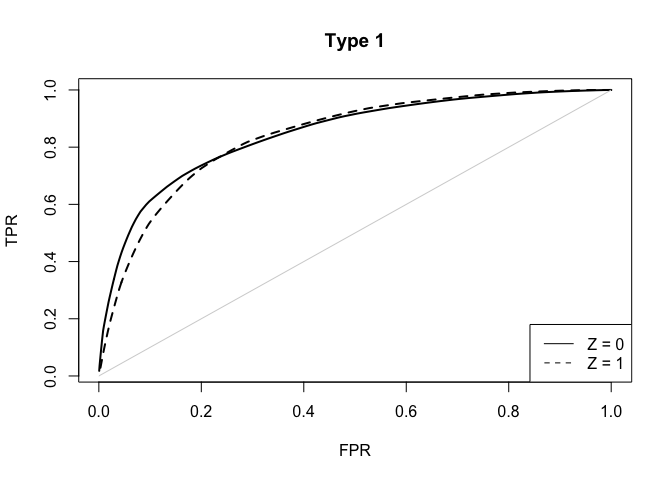

survCompetingRisk
========================================================

This package aims to help to evaluate the prognostic accuracy of a marker with multiple competing risk events. Functions to calculate the AUC, ROC, PPV, and NPV are provided. A discrete covariate Z, if available, can be included.

There are five main functions in this package:

1. `comprisk.ROC`: Calculate the values needed to plot the ROC curve, along with the AUC.

2. `comprisk.ROC.CI`: Calculate bootstrap confidence intervals for a given set of TPR or FPR values.

3. `comprisk.AUC.CI`: Calculate bootstrap confidence intervals for the AUC.

4. `comprisk.PPV`: Calculate PPV and NPV values.

5. `comprisk.PPV.CI`: Calculate bootstrap confidence intervals for a given set of PPV, NPV, or v (marker quantile).


### Tutorial


```r
library(survCompetingRisk)

#simulated data for illustration
data(crdata)

#take a look 
head(crdata)
```

```
##        times status1 status2          x Z
## 1 9.84883036       0       1 -1.3663182 1
## 2 1.72881288       1       0  0.1148226 0
## 3 0.49552382       1       0 -0.2008914 1
## 4 6.50569196       0       1  0.2233128 0
## 5 0.09322555       1       0  2.3786242 1
## 6 0.95367818       1       0  1.0352069 0
```


```r
##ROC curve 

#Set type = 1 if case is defined by the event of interest, and controls are all the rest. Set type = 2 if case is defined by stratifying on event type, and controls are those who have not experienced any events.

myROC.type1 <- comprisk.ROC( times = crdata$times,
                             status1 = crdata$status1, 
                             status2 = crdata$status2, 
                             x = crdata$x, 
                             Z = crdata$Z, 
                             predict.time = 10, 
                             type = 1)

myROC.type1
```

```
## $AUC
##         Z_0       Z_1
## 1 0.8489155 0.8413245
## 
## $ROC 
##          TPR       FPR Z
## 1  1.0000000 1.0000000 0
## 2  0.9995985 0.9851011 0
## 3  0.9989487 0.9704038 0
## 4  0.9982518 0.9557448 0
## 5  0.9974051 0.9412073 0
## 6  0.9965563 0.9266715 0
## 7  0.9955183 0.9122893 0
## 8  0.9944637 0.8979207 0
## 9  0.9932859 0.8836519 0
## 10 0.9920935 0.8693951 0
##  
##  ...(only first ten rows displayed)...
```

```r
#plot
tmp <- myROC.type1$ROC

plot(tmp$FPR[tmp$Z==0], tmp$TPR[tmp$Z==0], type="l",lwd=2, main="Type 1", xlab="FPR", ylab="TPR")
lines(tmp$FPR[tmp$Z==1], tmp$TPR[tmp$Z==1], lty=2, lwd=2)
legend(x="bottomright", c("Z = 0", "Z = 1"), lty=c(1,2))
lines(c(0, 1), c(0,1), col="lightgrey")
```

<!-- -->

```r
## type 2 

myROC.type2 <- comprisk.ROC( times = crdata$times,
                             status1 = crdata$status1, 
                             status2 = crdata$status2, 
                             x = crdata$x, 
                             Z = crdata$Z, 
                             predict.time = 10, 
                             type = 2)

myROC.type2
```

```
## $AUC
##        event1    event2
## Z_0 0.8537762 0.5425009
## Z_1 1.6909566 1.1010442
## 
## $ROC 
##    TPR.event1 FPR.event1 TPR.event2 FPR.event2 Z
## 1   1.0000000  1.0000000  1.0000000  1.0000000 0
## 2   0.9995985  0.9855387  0.9849776  0.9855387 0
## 3   0.9989487  0.9706154  0.9703441  0.9706154 0
## 4   0.9982518  0.9556401  0.9557743  0.9556401 0
## 5   0.9974051  0.9405470  0.9413937  0.9405470 0
## 6   0.9965563  0.9254528  0.9270156  0.9254528 0
## 7   0.9955183  0.9102868  0.9128547  0.9102868 0
## 8   0.9944637  0.8951176  0.8987120  0.8951176 0
## 9   0.9932859  0.8799377  0.8847005  0.8799377 0
## 10  0.9920935  0.8647580  0.8707043  0.8647580 0
##  
##  ...(only first ten rows displayed)...
```

```r
comprisk.AUC.CI( times = crdata$times,
              status1 = crdata$status1, 
              status2 = crdata$status2, 
              x = crdata$x, 
              Z = crdata$Z, 
              predict.time = 10, 
              type = 1, 
              bootstraps = 25) #set to 500-1000 in practice!
```

```
##   Z AUC_0.025 AUC_0.975
## 1 0 0.8296305 0.8719347
## 2 1 0.8162288 0.8549955
```


### References
Zheng Y, Cai T, Jin Y, Feng Z. Evaluating prognostic accuracy of biomarkers under competing risk. *Biometrics.* 2012 Jun;68(2):388-96.

Zheng Y, Cai T, Feng Z, and Stanford J. Semiparametric Models of Time-dependent Predictive Values of Prognostic Biomarkers. *Biometrics.* 2010, 66: 50-60.

